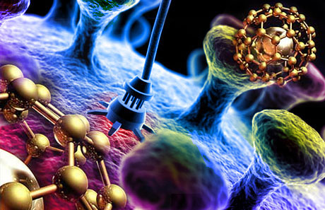

# **Transformative Role of Artificial Intelligence in Antimicrobial Research and Management.**

# What is Antimicrobial resistance?
Antimicrobial Resistance (AMR) occurs when bacteria, viruses, fungi, and parasites no longer respond to antimicrobial medicines. 

 
