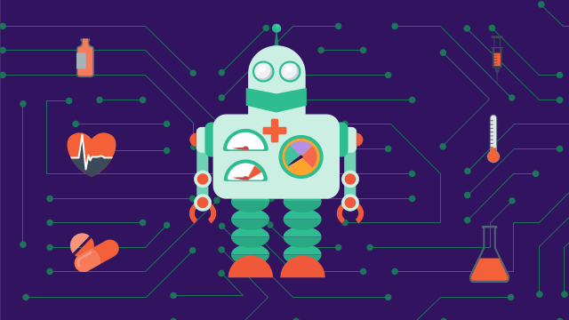
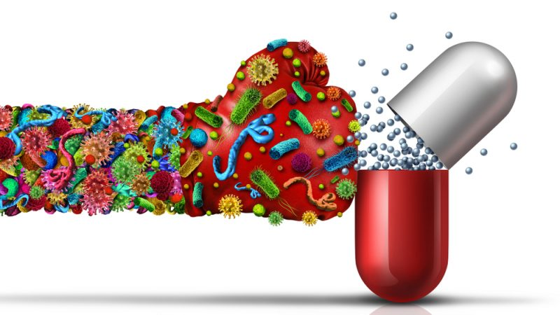

 Nov. 18 2023
 ***
# **Transformative Role of Artificial Intelligence in Antimicrobial Research and Management.**

My name is David, and I'm here to showcase the remarkable technological advancements in healthcare. follow my blog!
***
**What is Antimicrobial resistance?
Antimicrobial Resistance (AMR) occurs when bacteria, viruses, fungi, and parasites no longer respond to antimicrobial medicines. 

***
Artificial Intelligence (AI) is revolutionizing various fields, and its application in the realm of antimicrobial research and management holds immense promise. In this comprehensive exploration, we delve into the multifaceted ways in which AI can play a pivotal role in the fight against microbial threats, ranging from drug discovery to treatment optimization and epidemiological surveillance.

1. _Drug Discovery and Development_:
One of the most promising applications of AI in antimicrobial efforts is in drug discovery and development. Traditional methods for identifying potential antimicrobial compounds involve time-consuming and resource-intensive processes. AI algorithms, particularly machine learning models, can analyze vast datasets of molecular structures with unprecedented speed and efficiency.
These algorithms can identify patterns and relationships in biological data that might elude human researchers. By recognizing subtle connections between molecular structures and antimicrobial properties, AI can significantly expedite the drug discovery process. This is particularly crucial in the context of emerging infectious diseases and the pressing need for novel antimicrobial agents.

2. _Antimicrobial Resistance (AMR) Monitoring_:
AI is a powerful tool in monitoring and mitigating antimicrobial resistance. By analyzing large-scale genomic data, AI algorithms can track the evolution of antimicrobial resistance in microbial populations. This enables the early detection of resistant strains, providing valuable insights for public health strategies.
Machine learning models can predict the likelihood of resistance based on genetic information. This predictive capability is instrumental in tailoring treatment regimens to maximize efficacy while minimizing the risk of resistance development. The ability to anticipate and respond to emerging resistance patterns is crucial in maintaining the effectiveness of existing antimicrobial treatments.

3. _Diagnostic Tools_:
AI is transforming the landscape of diagnostic tools for microbial infections. AI-powered algorithms can rapidly analyze medical images, genomic data, and clinical information to identify the presence of microbial pathogens. This expedites the diagnostic process, allowing for quicker and more accurate identification of infectious agents.
In addition to traditional diagnostic methods, AI is facilitating the development of innovative approaches. Machine learning models can learn from diverse datasets to recognize subtle patterns indicative of infections. This can enhance the sensitivity and specificity of diagnostic tests, reducing the likelihood of false positives or negatives.
Chatbots and virtual assistants using AI are also being deployed in healthcare settings to assist with preliminary patient interactions. These tools can provide information on infectious diseases, guide individuals through symptom assessments, and offer recommendations for seeking further medical attention. In resource-constrained environments, AI-driven diagnostics can be particularly valuable in extending the reach of healthcare services.

4. _Treatment Optimization_:
AI contributes significantly to treatment optimization in the realm of antimicrobial therapies. By analyzing patient data, including genetic information, medical history, and current health status, AI algorithms can personalize treatment plans. This personalized approach enhances treatment efficacy while minimizing adverse effects.
Predictive modeling, a key component of AI, plays a crucial role in optimizing antibiotic dosages and treatment durations. This is particularly relevant in preventing the development of antimicrobial resistance. AI algorithms can adapt treatment regimens based on patient responses and evolving microbial dynamics, ensuring that treatments remain effective over time.
The optimization of treatment plans also extends to the realm of combination therapies. AI can analyze complex interactions between different antimicrobial agents, helping researchers and clinicians identify synergistic combinations that enhance therapeutic outcomes.

5. _Epidemiological Surveillance_:
AI contributes to the proactive monitoring and control of infectious diseases through advanced epidemiological surveillance. By analyzing data from various sources, including social media, healthcare records, and environmental monitoring, AI can track and predict the spread of infectious diseases.
Machine learning models can identify patterns indicative of disease outbreaks, enabling timely interventions. This can include targeted public health campaigns, resource allocation, and the implementation of preventive measures. The ability to forecast disease spread is especially crucial in the context of emerging infectious diseases and global health crises.

6. _Robotics in Healthcare_:
AI-powered robotics is making inroads into healthcare, offering innovative solutions for infection prevention and control. Robots equipped with AI capabilities can perform tasks such as cleaning and disinfecting healthcare facilities. This reduces the risk of hospital-acquired infections, a significant concern in healthcare settings.
Telepresence robots, driven by AI, enable remote consultations and interactions. This is particularly valuable in situations where physical presence is challenging or risky. Healthcare professionals can use these robots to provide expertise from a distance, facilitating the delivery of healthcare services in diverse settings.

7. _Data Analysis and Integration_:
The strength of AI lies in its ability to analyze and integrate diverse datasets. In the context of antimicrobial research, this includes clinical data, genomic information, environmental factors, and more. By synthesizing these diverse sources of information, AI provides a more comprehensive understanding of microbial threats.
Predictive modeling, a core component of AI, harnesses the power of integrated data to forecast disease trends and identify potential risk factors. This information is invaluable for public health planning and intervention strategies. AI's capacity to analyze large and complex datasets surpasses traditional methods, offering a more nuanced and accurate perspective on microbial dynamics.

8. _Natural Language Processing (NLP) for Literature Review_:
AI, specifically Natural Language Processing (NLP), is transforming the way researchers engage with scientific literature. NLP algorithms can quickly review and analyze vast amounts of text, extracting relevant information and insights from a sea of publications.
In the field of antimicrobial research, this capability is particularly beneficial for staying abreast of the latest developments. Researchers can efficiently review a multitude of scientific articles, identify emerging trends, and integrate new knowledge into their work. The speed and accuracy of NLP-driven literature reviews enhance the efficiency of the research process.
In conclusion, the integration of AI into antimicrobial research and management is reshaping the landscape of infectious disease control. From drug discovery to treatment optimization and epidemiological surveillance, AI offers a diverse set of tools that enhance the effectiveness and efficiency of antimicrobial efforts. The synergy between advanced technology and the complex challenges posed by microbial threats holds great promise for the future of global health. As we navigate the dynamic landscape of infectious diseases, AI stands as a powerful ally in the ongoing battle against microbial adversaries
***

Dec. 10 2023
***
## Where Resistance Spreads: Across the World

Antimicrobial resistance (AMR) poses a growing threat to global public health, challenging the effectiveness of antibiotics and other antimicrobial agents. This phenomenon is not limited to specific regions; instead, it traverses geographical boundaries, affecting communities across the world. Understanding the dynamics of how resistance spreads is essential for developing comprehensive strategies to mitigate its impact. In this exploration, we delve into the various factors contributing to the global spread of antimicrobial resistance and the implications for affected populations.

Antimicrobial resistance is an urgent global public health threat, killing at least 1.27 million people worldwide and associated with nearly 5 million deaths in 2019. In the U.S., more than 2.8 million antimicrobial-resistant infections occur each year. Germs will inevitably find ways to resist antibiotics and antifungals, which is why aggressive action is needed now to keep new resistance from developing and to prevent the resistance that already exists from spreading.

1. _Globalization and Travel_:
One of the primary drivers of the worldwide dissemination of antimicrobial resistance is globalization. Increased international travel and trade facilitate the movement of people, goods, and pathogens across borders. Resistant strains of bacteria can hitch a ride with individuals, spreading from one region to another. The constant flow of individuals between countries creates an interconnected web through which resistance can proliferate.

2. _Agricultural Practices_:
The use of antimicrobials in agriculture, particularly in livestock farming, contributes significantly to the global spread of resistance. Agricultural practices often involve the routine administration of antibiotics to animals for growth promotion and disease prevention. Resistant bacteria originating in farms can enter the food chain, affecting both animals and humans. The widespread distribution of food products globally further exacerbates this issue.

3. _Inadequate Sanitation and Healthcare Infrastructure_:
Regions with inadequate sanitation and healthcare infrastructure face higher risks of antimicrobial resistance. Limited access to clean water and sanitation facilities can lead to the uncontrolled spread of infections, prompting the overuse of antibiotics. In such environments, resistant strains can emerge and thrive, posing a severe threat to public health.

4. _Overuse and Misuse of Antibiotics_:
Across the world, the overuse and misuse of antibiotics contribute significantly to the rise of resistance. Factors such as self-medication, incomplete treatment courses, and unrestricted access to antibiotics without prescriptions foster an environment conducive to the development of resistant strains. Educational initiatives are crucial to address these practices and promote responsible antibiotic use.

5. _Climate Change Impacts_:
Climate change has indirect effects on the spread of antimicrobial resistance. Altered environmental conditions can influence the prevalence and distribution of infectious diseases. Additionally, extreme weather events may disrupt healthcare systems and exacerbate the overuse of antibiotics in response to increased disease burdens.

6. _Cross-Species Transmission_:
The movement of resistance across species further complicates the global landscape. Bacterial resistance genes can transfer between different species of bacteria, including those affecting humans, animals, and the environment. This horizontal gene transfer adds another layer of complexity to the dynamics of antimicrobial resistance.

7. _Socioeconomic Disparities_:
Socioeconomic factors play a crucial role in the global spread of resistance. Disparities in healthcare access, education, and economic opportunities contribute to variations in antibiotic usage patterns. Lower-income communities may face challenges in implementing effective antimicrobial stewardship programs, fostering conditions conducive to resistance.

8. _International Collaboration and Surveillance_:
Efforts to curb the global spread of antimicrobial resistance require international collaboration and robust surveillance systems. Initiatives like the Global Antimicrobial Resistance Surveillance System (GLASS) aim to monitor resistance patterns worldwide, enabling timely interventions and the sharing of best practices among countries.

9. _Cultural and Behavioral Influences_:
Cultural practices and societal behaviors influence the use of antimicrobials. Cultural beliefs, traditions, and norms can impact healthcare-seeking behaviors and attitudes toward antibiotic use. Tailoring interventions to align with cultural contexts is vital for the success of antimicrobial resistance mitigation strategies.

10. _The Role of Technology and Innovation_:
Advancements in technology, including artificial intelligence, genomics, and rapid diagnostic tools, can revolutionize our approach to combating antimicrobial resistance. These innovations enable more precise diagnostics, targeted treatments, and data-driven interventions on a global scale.
In conclusion, the global spread of antimicrobial resistance is a multifaceted challenge that requires a comprehensive and collaborative response. Addressing the root causes, promoting responsible practices, and fostering international cooperation are crucial steps toward preserving the effectiveness of antimicrobial agents. The interconnectedness of our world necessitates a united effort to safeguard the health of current and future generations against the escalating threat of antimicrobial resistance.
-----

Dec. 23 2023
--
Transformative Actions to Combat Antimicrobial Resistance
-------

The surge of resistant strains among bacteria, viruses, and other pathogens necessitates immediate and innovative solutions.

1. Precision Diagnostics:
AI-powered diagnostic tools hold the potential to revolutionize disease identification. These tools can rapidly analyze clinical samples, identifying pathogens and their resistance traits with unprecedented speed and accuracy. This accelerated identification enables healthcare providers to prescribe targeted treatments promptly, reducing the unnecessary use of broad-spectrum antibiotics and mitigating the risk of resistance development.

2. Drug Discovery and Development:
The process of drug discovery and development can be arduous and time-consuming. AI algorithms, capable of analyzing vast datasets, including genomic information, can expedite this process. By predicting molecular interactions with pathogens, AI aids researchers in identifying potential drug candidates swiftly, offering hope for the development of novel antimicrobial agents.

3. Personalized Treatment Plans:
AI-driven predictive analytics can evaluate patient data, considering factors such as genetics, previous treatments, and microbial profiles. This enables the tailoring of treatment plans to individual patients, optimizing efficacy while minimizing the risk of resistance development. Personalized medicine, augmented by AI, stands as a beacon in the quest for more effective and sustainable healthcare.

4. Surveillance and Early Detection:
AI's ability to analyze diverse datasets from electronic health records, public health reports, and other sources enhances surveillance capabilities. By detecting trends and patterns, AI provides early warnings of potential outbreaks and identifies regions with high resistance prevalence. This proactive approach allows for timely intervention, mitigating the impact of emerging resistance challenges.

5. Behavioral Interventions:
Understanding prescribing patterns and patient behaviors is crucial in addressing AMR. AI algorithms can analyze this data, identifying areas of concern and informing targeted interventions. Educational campaigns for healthcare professionals and the public, promoting responsible antibiotic use, can be strategically designed based on AI-driven insights.

6. Robotics in Healthcare:
AI-driven robotics can play a significant role in minimizing the spread of infections in healthcare settings. Automated systems for drug dispensing, patient monitoring, and cleaning contribute to reducing the risk of healthcare-associated infections. This, in turn, lessens the subsequent need for antimicrobial treatments.

7. Data Integration and Interoperability:
AI's capacity to integrate diverse datasets from healthcare, agriculture, and environmental monitoring supports a holistic approach to combating AMR. This One Health approach addresses the interconnectedness of human, animal, and environmental factors in the development and spread of resistance. AI facilitates the seamless integration and interoperability of data, allowing for a more comprehensive understanding of the complex factors influencing AMR.
Challenges and Considerations:
While the potential of AI in combating AMR is promising, several challenges must be addressed. Issues such as data privacy concerns, standardization of data formats for interoperability, and the need for robust regulatory frameworks to ensure the ethical use of AI in healthcare represent significant considerations.
 In the face of escalating antimicrobial resistance, the integration of artificial intelligence into healthcare systems and public health initiatives emerges not just as an option but as an imperative. The collaborative synergy between human expertise and AI capabilities offers a paradigm shift in our ability to prevent, diagnose, and treat infectious diseases with unprecedented efficacy. As we navigate the complexities of combating AMR, the marriage of human ingenuity and AI promises a brighter future for global health security. By embracing AI as a valuable ally in the fight against resistance, we take a monumental step forward in safeguarding the efficacy of our antimicrobial arsenal for generations to come. The transformative actions outlined here herald a new era in healthcare, where the convergence of human and artificial intelligence capabilities leads to a more resilient and responsive global health ecosystem.
----

Jan. 01 2024
----
Navigating Challenges for a Promising Future 
-----
__AI into antimicrobial research and management, spanning issues related to data, interpretability, ethics, regulation, and more._

---
1. Data Quality and Bias in AI Models:= 
One of the primary challenges in deploying AI in antimicrobial research is the reliance on historical datasets. Biases present in these datasets, whether due to demographic skewness or incomplete representation, can significantly impact the performance of AI models. If the training data is not diverse and comprehensive, the AI algorithms may exhibit biased results, leading to disparities in treatment recommendations across different patient groups. It is crucial to address these biases to ensure equitable and effective healthcare solutions.

2. Interpretability and Explainability:-
The "black box" nature of some AI models poses a significant hurdle. Healthcare professionals often require a clear understanding of how AI arrives at its conclusions to trust its recommendations. In antimicrobial research and management, where treatment decisions can be critical, the lack of interpretability and explainability may hinder the widespread adoption of AI. Striking a balance between model complexity and interpretability is essential to foster trust among healthcare providers and patients.

3. Regulatory Compliance and Standards:=
As the landscape of healthcare technology evolves, regulatory frameworks must keep pace. The current regulatory environment may not be fully equipped to address the nuances of AI applications in antimicrobial research. Establishing clear guidelines and standards that align with the ethical and legal considerations of AI in healthcare is imperative. Stricter regulations and robust compliance mechanisms are essential to ensure patient safety, data privacy, and overall system integrity.

4. Integration with Existing Systems:-
The seamless integration of AI into existing healthcare infrastructures is a formidable challenge. Many healthcare institutions operate with legacy systems that may not readily accommodate advanced AI technologies. The cost and complexity of upgrading or replacing these systems can pose obstacles to the effective implementation of AI in antimicrobial research and management. Strategic planning and collaboration are key to navigating this challenge successfully.

 5. Ethical Considerations in AI-Driven Decision-Making:=
AI algorithms play a growing role in influencing treatment decisions. Ethical concerns arise when algorithms become a part of the decision-making process, especially in critical areas like antimicrobial treatment planning. Balancing the autonomy of AI systems with the ethical responsibility of healthcare professionals is a delicate task. The ethical implications of AI in healthcare demand careful consideration, particularly in scenarios where AI-generated recommendations directly impact patient well-being.

 6. Resource Allocation for AI Implementation:-
Implementing and maintaining AI systems in healthcare require substantial resources, including financial investments, skilled personnel, and advanced computing infrastructure. Small healthcare facilities or those in resource-limited settings may face challenges in adopting AI technologies. Addressing the resource allocation issue is crucial to ensure that the benefits of AI in antimicrobial research are accessible across diverse healthcare contexts.

 7. Patient Privacy and Security:=
The sensitive nature of healthcare data, especially in the context of antimicrobial research, necessitates stringent measures for patient privacy and security. AI applications often involve the processing of vast amounts of personal health information. Ensuring compliance with data protection regulations, establishing robust security protocols, and obtaining informed consent from patients are critical components of a responsible AI deployment strategy.

 8. Human-AI Collaboration and Acceptance:-
The successful integration of AI in antimicrobial research requires collaboration between AI systems and human healthcare professionals. However, resistance or hesitancy among healthcare providers to trust AI recommendations can impede effective collaboration. Overcoming these challenges involves not only addressing technical issues but also fostering a culture of trust and understanding among healthcare professionals regarding the complementary role of AI in their decision-making processes.

 9. Unintended Consequences of AI in Healthcare:=
The implementation of AI in healthcare is not without risks. Unintended consequences, such as unexpected biases, errors, or misinterpretations, can have profound implications for patient safety. Continuous monitoring, rigorous testing, and a commitment to rectifying unintended consequences are essential aspects of responsible AI deployment in antimicrobial research and management.

 10. Generalization to New Pathogens:-
The adaptability of AI models to new and emerging pathogens is a critical consideration. AI models trained on existing data may struggle to generalize effectively to previously unseen microbial threats. The dynamic nature of infectious diseases demands AI systems that can rapidly adjust and learn from evolving datasets.
In conclusion, while the transformative role of AI in antimicrobial research and management is undeniably promising, navigating the associated challenges is crucial for realizing its full potential. Addressing these problems requires a multidimensional approach, encompassing technological advancements, ethical considerations, regulatory frameworks, and collaborative efforts across healthcare domains. As the field continues to evolve, an ongoing commitment to overcoming these challenges will be essential to ensure the responsible and impactful integration of AI in the fight against antimicrobial resistance.
---
Jan. 08 2024
----
Using Nanoparticles to Combat Antibiotic-Resistant Bacteria: A Revolutionary Approach in Medicine
---
Antibiotic resistance, an escalating global health crisis, poses a significant threat to the efficacy of conventional antibiotics and modern medical treatments. As bacteria evolve to withstand traditional antibiotic drugs, researchers and scientists are exploring innovative strategies to overcome this challenge. One groundbreaking avenue gaining prominence is the utilization of nanoparticles to combat antibiotic-resistant bacteria. In this discourse, we delve into the science, potential applications, and challenges associated with harnessing nanoparticles as a formidable weapon in the battle against antibiotic resistance.
Understanding Antibiotic Resistance: A Growing Menace
Antibiotics have been instrumental in treating bacterial infections since the discovery of penicillin by Alexander Fleming. However, the overuse and misuse of antibiotics in various sectors, including healthcare, agriculture, and aquaculture, have led to the emergence of antibiotic-resistant strains of bacteria. These resilient microbes can render conventional antibiotics ineffective, complicating the treatment of once easily manageable infections.
The rise of antibiotic-resistant bacteria has necessitated a paradigm shift in the approach to infectious diseases. Traditional methods are proving insufficient in the face of rapidly evolving bacterial defenses. Consequently, the scientific community is exploring novel strategies to address this pressing issue, with nanotechnology emerging as a promising frontier.
The Rise of Nanoparticles: A Miniaturized Marvel
Nanoparticles, defined as particles with dimensions ranging from 1 to 100 nanometers, exhibit unique properties that distinguish them from their macroscopic counterparts. These properties, such as a high surface area-to-volume ratio and quantum effects, make nanoparticles an attractive candidate for combating antibiotic-resistant bacteria.
The small size of nanoparticles allows them to interact with biological systems at the molecular and cellular levels. This unique characteristic enables precise targeting and interaction with bacterial cells, offering a level of specificity unmatched by traditional antibiotics.
Mechanisms of Action: Nanoparticles vs. Antibiotic Resistance

1. Targeted Delivery: Precision in Combat
One of the key advantages of nanoparticles is their ability to deliver therapeutic agents with unparalleled precision. Functionalized nanoparticles can be engineered to selectively target bacterial cells, leaving healthy cells unharmed. This targeted delivery minimizes collateral damage and enhances the efficacy of antimicrobial agents, overcoming the limitations associated with broad-spectrum antibiotics.

2. Enhanced Penetration: Breaking Down Barriers
Bacterial biofilms, a common defense mechanism against antibiotics, pose a formidable challenge in the treatment of infections. Nanoparticles, owing to their small size, can penetrate biofilms more effectively than traditional antibiotics. This enhanced penetration disrupts the biofilm structure and exposes bacteria to antimicrobial agents, overcoming a significant hurdle in the battle against antibiotic-resistant strains.

3. Multifunctionality: A Versatile Arsenal
Nanoparticles offer a versatile platform for combating antibiotic resistance by incorporating various functionalities. These multifunctional nanoparticles can simultaneously carry and release multiple therapeutic agents, including antibiotics, antifungals, and even genetic material. This multifaceted approach disrupts multiple pathways in bacterial resistance, making it more challenging for bacteria to develop resistance.

Applications of Nanoparticles in Medicine :

1. Drug Delivery Systems: Precision Medicine Unleashed
Nanoparticles serve as carriers for drug delivery systems, ensuring the controlled and targeted release of therapeutic agents. This approach not only improves the efficacy of antibiotics but also reduces the side effects associated with systemic drug administration. From liposomal formulations to polymeric nanoparticles, researchers are exploring diverse strategies to optimize drug delivery and combat antibiotic resistance.

2. Photothermal and Photodynamic Therapy: Light-Driven Antimicrobial Action
Nanoparticles can harness light energy for therapeutic purposes. In photothermal therapy, nanoparticles absorb light and convert it into heat, selectively destroying bacterial cells. Similarly, photodynamic therapy involves the activation of photosensitive nanoparticles to produce reactive oxygen species, inducing bacterial cell death. These light-driven approaches offer a promising alternative for treating infections caused by antibiotic-resistant bacteria.

3. Nanoparticle-Coated Surfaces: Antimicrobial Environments
Incorporating nanoparticles into surface coatings for medical devices and implants creates antimicrobial environments. These nanoparticle-coated surfaces can prevent bacterial adhesion and biofilm formation, reducing the risk of infections associated with medical interventions. This preventive approach is particularly crucial in the context of antibiotic-resistant bacteria, where infections can be challenging to treat.

Challenges and Future Perspectives
While the potential of nanoparticles in combating antibiotic resistance is promising, several challenges must be addressed. The biocompatibility and long-term safety of nanoparticles, potential environmental impacts, and the scalability of production are critical considerations. Additionally, the risk of nanoparticles contributing to the development of new forms of resistance must be carefully studied.

in summary or the cardinal view of the whole thing is  A Paradigm Shift in Antimicrobial Strategies
The use of nanoparticles to combat antibiotic-resistant bacteria marks a paradigm shift in antimicrobial strategies. This nanotechnology-driven approach holds immense potential for revolutionizing the field of medicine, off
---

-------------
##[Automation Blog][Automation.md]
--------------

source : chatgpt and cdc

 

 
